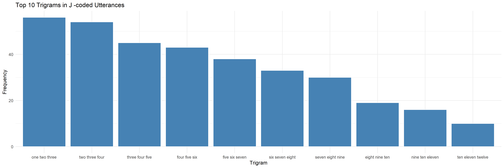
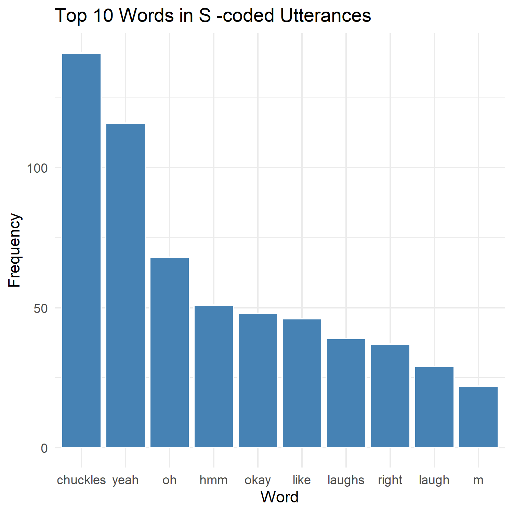
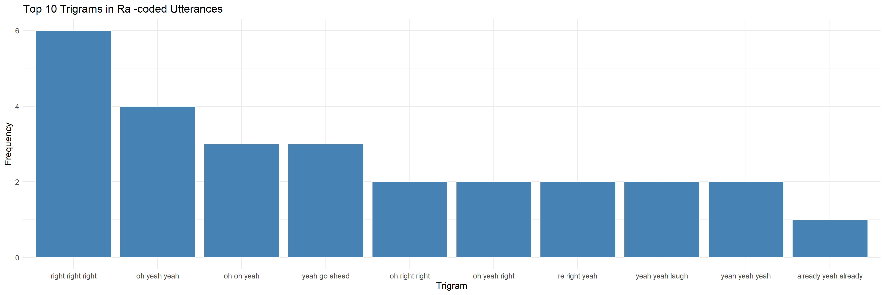

# collaborative-learning
Analysis of n-gram frequencies in a collaborative learning corpus

# Overview
This repository contains code for analyzing n-gram frequencies in a collaborative learning corpus coded with the following speech acts by 3 independent raters (see <b>References</b> for more information on the coding scheme):
- Explain (E)
- Propose (P)
- Question for Consideration (Qc)
- Question for Information (Qi)
- Response to Agree (Ra)
- Response to Modify (Rm)
- Social Facilitation (S)
- Coordinate Joint Attention (J)
- Interruption (N)
  
The purpose of the n-gram frequency analysis is to identify important features for classifying the above speech acts.
The collaborative learning task that participants were asked to solve in the collaborative learning corpus was a map-drawing challenge. Pairs of participants were given a map with several villages and asked to work together to design a road network that connected the villages, using the least possible amount of road and simultaneously plotting the shortest possible route that visited all villages.

# Methods
I filter data by considering only speech acts for which at least 2 of 3 raters agreed on the label. I split utterances into uni/bi/trigrams, filter out [stop-words](https://gist.github.com/sebleier/554280), and rank the frequencies at which all uni/bi/trigrams occur within each type of speech act. The code for the analysis can be found in <b>scripts</b>.

# Results and Discussion
The distribution of unigrams is not distinctive across speech acts, with the exception of the Social Facilitation speech act, for which many non-verbal social signals were captured. High-frequency bigrams are the most helpful for classifying less common speech acts, while trigrams can help in classifying common yet hard-to-differentiate and/or frequently co-occurring speech acts (e.g. Explain v. Propose). For example, using bigrams allows one to differentiate between "right" (the direction opposite from "left," as in the Explain speech act) and "right right right" (expressing agreement, as in the Response to Agree speech act).

1. Although numeric n-grams (e.g., "one two three") appear frequently for multiple codes, the Coordinate Joint Attention speech act (J) is differentiated by the fact that all 10 most frequent trigrams are sequences of numbers. This reflects that when coordinating joint attention to a physical points on the map, learning partners would often count out sequences of points.

2. Unlike the other speech acts, Social Facilitation (S) appears to be better distinguished from other speech acts by its distribution of unigrams, rather than bi- or tri-grams (e.g., "laughs" and "laugh" are picked up in the top 10 unigrams but not in the top 10 bigrams).

3. As expected based on the coding scheme, the Response to Agree (Ra) speech act features phrases of agreement, such as "oh yeah yeah," "right right right," and "makes sense."

# References
The data analyzed in this repository were collected during the pilot study described in Dr. Katherine Moore's dissertation:

Moore, K. S. (2021). <i>Learning through Collaboration: Designing Collaborative Activities to Promote Individual Learning</i> (Order No. 28771707). Available from Dissertations & Theses @ Columbia University; ProQuest Central; ProQuest Dissertations & Theses Global. (2592931086). http://ezproxy.cul.columbia.edu/login?url=https://www.proquest.com/dissertations-theses/learning-through-collaboration-designing/docview/2592931086/se-2

